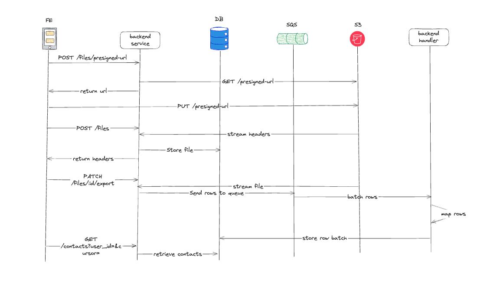

# **CSV Import**

CSV Import is a service designed to efficiently process and manage CSV file uploads. It provides a backend API to handle CSV file processing and a frontend for users to upload and monitor their imports.

## **Architecture**



## **Live Website**

- **Frontend:** [csv-import-web.vercel.app](https://csv-import-web.vercel.app/)
- **Backend:** [csv-backend-production.up.railway.app](https://csv-backend-production.up.railway.app/)

## **Installation**

This project uses **Turborepo** for monorepo management. To set up and run the entire project, follow these steps:

```sh
1. docker compose up -d  # Start required services (DB, etc.)
2. pnpm install          # Install dependencies
3. pnpm build:web        # Build the frontend
4. pnpm build:backend    # Build the backend
```

## **Deployments**

Our infrastructure is deployed across the following services:

- **Backend:** Railway
- **Frontend:** Vercel
- **Database:** Supabase
- **File Storage & Queue:** AWS S3 & SQS

## **Usage**

You can import the Postman collection located in the `/docs` folder at the root of the project to test API endpoints.

Additionally, there is a script (`csv-generator.py`) in the project that generates a CSV file with 1 million rows for testing and benchmarking purposes.

## **Improvements**

We aim to enhance the project with the following improvements:

- [ ] Implement structured logging with **Pino**
- [ ] Improve **error handling** across all layers
- [ ] Add **unit** and **integration tests**

## **Performance Considerations**

Processing large CSV files in **Node.js** is not optimal. I benchmarked this application against **Golang** and **Polars (Python)**, and both were significantly faster processing the entire CSV in **under a second**.
